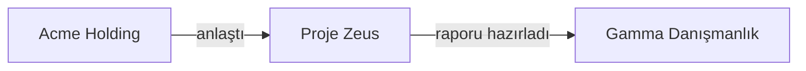
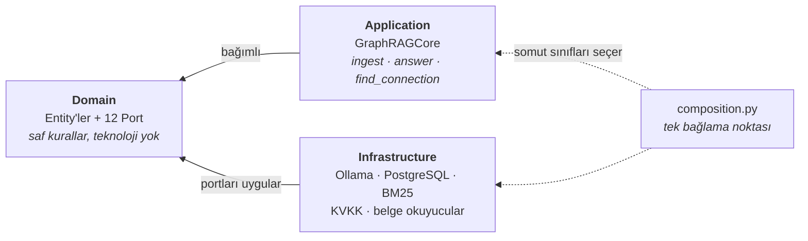
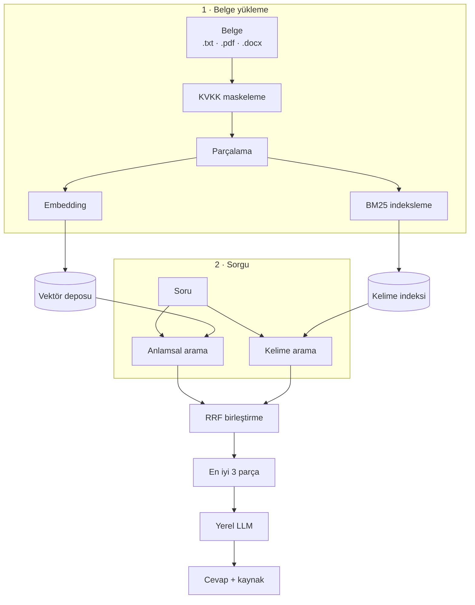

# Arşiv Zekâsı — Kurumsal GraphRAG

Kurumsal ve hukuki belge arşivleri için **tamamen yerelde çalışan**, KVKK-uyumlu
bir belge analiz sistemi. Belgelerinize doğal dille soru sorabilir, farklı
belgelerdeki varlıklar arasındaki **gizli bağlantıları** keşfedebilirsiniz.

Yapay zekâ yerelde (Ollama) çalışır; **hiçbir veri buluta gönderilmez.**

---

## Çözdüğü problem

Arşivdeki iki ayrı belge (`ornek_belgeler/` klasöründen):

```
01_acme_danismanlik_sozlesmesi.txt
    "ACME HOLDİNG A.Ş. ... PROJE ZEUS için stratejik danışmanlık
     hizmeti almak üzere işbu sözleşmeyi imzalamıştır."

02_proje_zeus_toplanti_tutanagi.txt
    "... fizibilite raporunun hazırlanması işinin GAMMA DANIŞMANLIK
     LTD. ŞTİ. tarafından yürütülmesine karar verilmiştir."
```

**"Acme Holding ile Gamma Danışmanlık bağlantılı mı?"**

Bu iki firma **hiçbir belgede birlikte geçmiyor** — Ctrl+F veya klasik arama
bulamaz. Sistem, belgelerden çıkardığı bilgi grafı üzerinde ikisini birbirine
bağlayan ara halkayı bulur:



`Birleşik güven: 0.64 · 2 adım · 0.02 saniye`

Dikkat edilecek nokta: sistem yalnızca "bağlılar" demez, **her adımın ilişki
türünü** de metinden çıkarır — böylece zincir okunabilir ve denetlenebilir olur.

Sonuç bir yapay zekâ tahmini değildir. Graf üzerinde **Dijkstra algoritması**
çalışır; kenar ağırlığı olarak güven skorunun `-log` değeri kullanılır. Bir
yolun toplam güveni adımların çarpımı olduğundan, logaritma bu çarpımı toplama
çevirir ve **en kısa yol = en güvenilir zincir** hâline gelir. Aynı soru her
zaman aynı cevabı verir.

---

## Sistem üç yaklaşımı birleştirir

| | Ne yapar | Nasıl |
|---|---|---|
| **Hibrit arama** | Soruya en ilgili metni bulur | Anlamsal (embedding) + anahtar kelime (BM25), RRF ile birleştirme |
| **Bilgi grafı** | Gizli ilişkileri bulur | Varlık çıkarımı → graf → Dijkstra (`-log(güven)` ağırlık) |
| **KVKK katmanı** | Kişisel veriyi korur | TCKN/VKN/IBAN maskeleme + denetim kaydı |

Her cevap, **dayandığı belgeyi kaynak olarak gösterir** — hukuki kullanımda
doğrulanabilirlik esastır.

---

## Kurulum

### Gereksinimler

| | Zorunlu mu | Not |
|---|---|---|
| **Python 3.9+** | Evet | |
| **[Ollama](https://ollama.com)** | Evet | Yapay zekâ modellerini yerelde çalıştırır |
| **Docker** | Hayır | Yalnızca verilerin kalıcı olması için |

### Adımlar

```bash
# 1) Projeyi indirin
git clone https://github.com/selimdogann/Enterprise-GraphRAG.git
cd Enterprise-GraphRAG

# 2) Python ortamı
python3 -m venv .venv
source .venv/bin/activate          # Windows: .venv\Scripts\activate
pip install -r requirements.txt

# 3) Yapay zekâ modelleri (~6 GB, tek seferlik)
ollama pull qwen2.5:7b             # cevap üretimi
ollama pull bge-m3                 # metin → vektör

# 4) Başlatın  (Windows/macOS/Linux)
python3 scripts/baslat.py
```

`baslat.py` her şeyi sırayla açar (Ollama → veritabanı → sunucu), modelleri
önden ısıtır ve sonunda arayüz adresini + API anahtarını yazdırır.

Durdurmak için:

```bash
python3 scripts/durdur.py
```

> Sunucu terminalden **bağımsız** başlatılır — böylece betik bitince terminal
> serbest kalır ve terminali kapatsanız da sistem çalışmaya devam eder.
> Bu yüzden Ctrl+C sunucuyu durdurmaz; durdurmak için yukarıdaki betiği kullanın.

> **Docker kurmadıysanız** sorun değil — sistem otomatik olarak bellek-içi
> modda çalışır, yalnızca veriler uygulama kapanınca kaybolur.

Elle başlatmak isterseniz: `uvicorn graphrag.api:app`

---

## Kullanım

Tarayıcıda: **http://localhost:8000/app/**

1. **Belge yükleyin** — `ornek_belgeler/` klasöründeki 5 örnek belgeyi sürükleyip
   bırakın (hazır test verisi; içerikleri tamamen uydurmadır).
2. **Soru sorun** — "Gamma Danışmanlık ne iş yaptı?" Cevabın altında hangi
   belgeden geldiği görünür.
3. **Bağlantı bulun** — Kaynak: `Acme Holding`, Hedef: `Gamma Danışmanlık`.
   Zincir graf üzerinde çizilir.
4. **KVKK denetim kaydını inceleyin** — belgelerdeki TCKN/IBAN/VKN değerlerinin
   nasıl maskelendiğini gösterir.

Belge listesindeki çöp kutusu simgesiyle tek bir belgeyi, "Tümünü sil" ile
arşivin tamamını kaldırabilirsiniz. Silme yalnızca o belgeyi değil, ondan
türeyen parça ve ilişkileri de temizler; başka belgelerin de desteklediği
varlıklar (örneğin iki belgede birden geçen `Proje Zeus`) grafta kalır.

İlk açılışta arayüz sağ üstten **API anahtarı** ister; `baslat.py` çıktısındaki
anahtarı yapıştırmanız yeterli (tarayıcı hatırlar).

---

## Mimari

**Clean Architecture (Ports & Adapters)** — üç katman, bağımlılıklar hep içe doğru:



Çekirdek (`GraphRAGCore`) hiçbir somut teknolojiyi bilmez; yalnızca soyut
sözleşmelere (portlara) bağımlıdır. Bu sayede **bellek-içi depodan PostgreSQL'e,
sahte LLM'den gerçek modele ve yalnızca-metinden PDF/Word desteğine geçiş —
üçü de çekirdek koda dokunulmadan** yapıldı.

```
graphrag/
├── domain/           # Entity'ler + portlar (sözleşmeler)
├── application/      # GraphRAGCore — kullanım senaryoları
├── infrastructure/   # Adaptörler: LLM, vektör, graf, kalıcılık, KVKK
└── composition.py    # Bağımlılıkların bağlandığı tek yer
```

### Sorgu akışı



---

## Kullanılan yöntemler

| Konu | Uygulama |
|---|---|
| **Graf araması** | Dijkstra; kenar ağırlığı `-log(güven)` — en kısa yol = **en güvenilir zincir** |
| **İlişki çıkarımı** | Metinden (özne, ilişki, nesne) üçlüleri; tipli kenarlar co-occurrence'tan daha yüksek güven alır |
| **Hibrit retrieval** | Embedding + BM25, **Reciprocal Rank Fusion** ile birleştirme |
| **Belge yaşam döngüsü** | Sonlu durum makinesi (DFA): `RECEIVED → PARSING → PARSED` |
| **Silme tutarlılığı** | Graf düğüm/kenarlarında **köken (provenance)** takibi — belge silinince yalnızca desteksiz kalanlar düşer |
| **Kimlik doğrulama** | TCKN/VKN/IBAN **checksum** algoritmaları |
| **Türkçe metin** | İ/ı normalizasyonu, aksan katlama, şirket eki temizliği |
| **Önbellek** | Decorator deseniyle memoization |
| **Güvenlik** | API anahtarı; zamanlama saldırısına dayanıklı karşılaştırma |

**Teknolojiler:** Python · FastAPI · PostgreSQL + pgvector · SQLAlchemy ·
Ollama (`qwen2.5:7b`, `bge-m3`) · rank-bm25 · pytest · Docker · GitHub Actions

---

## Testler

```bash
python -m pytest
```

**152 test** — birim ve entegrasyon. Dış bağımlılıklar (LLM, dosya sistemi)
sahte nesnelerle değiştirilir; testler internet veya model gerektirmez.
Her Pull Request'te **GitHub Actions** ile otomatik çalışır.

> `DATABASE_URL` tanımlı değilse 8 PostgreSQL testi otomatik atlanır.

---

## Performans

M4 / 16 GB üzerinde ölçülen değerler:

| İşlem | Süre |
|---|---|
| Graf bağlantı bulma | **0.02 sn** (yapay zekâ kullanmaz) |
| Soru-cevap | 5.5 – 7.5 sn (yerel model üretimi) |
| Tekrarlanan soru | 0.015 sn (önbellek) |

---

## Bilinen sınırlar ve gelecek çalışmalar

Aşağıdakiler bilinçli kapsam kararlarıdır; sistemin bugünkü hâlinin sınırlarını
açıkça ortaya koyar.

| Sınır | Bugünkü durum | Yapılabilecek |
|---|---|---|
| **İlişki yönü** | Etiket zincirde okunduğu yönde çevrilmez — yukarıdaki örnekte raporu hazırlayan aslında Gamma'dır, ok ise Zeus'tan çıkar | Kenarı yönüne göre çevirme (`hazırladı` ⇄ `hazırlandı`) |
| **Ölçek** | 5 belgelik bir gösterim; büyük arşivle denenmedi | pgvector indeksleme (HNSW) + asenkron yükleme kuyruğu |
| **Retrieval hassasiyeti** | Hibrit arama var, yeniden sıralayıcı (reranker) yok | Cross-encoder reranker — çok adaylı aramada isabeti artırır |
| **Aktarım güvenliği** | API anahtarı HTTP üzerinden düz metin gider | Ters proxy arkasında HTTPS |
| **Yetkilendirme** | Tek anahtar; "kim ne yaptı" izlenmiyor | Kullanıcı bazlı giriş + rol tabanlı yetki (KVKK denetimi için değerli) |
| **Varlık çıkarımı** | Yerel model Türkçe metni bazen bozuk kopyalıyor | Türkçe'ye özel NER modeli; şu an belgeye sabitleme (grounding) ile tolere ediliyor |
| **Belge formatları** | `.txt`, `.pdf`, `.docx` | Taranmış belgeler için OCR |

---

## Diğer komutlar

```bash
python3 scripts/baslat.py            # tüm servisleri başlat
python3 scripts/durdur.py            # servisleri durdur (--hepsi: Ollama dahil)
python3 scripts/reset_archive.py     # arşivi tamamen sıfırla
```
